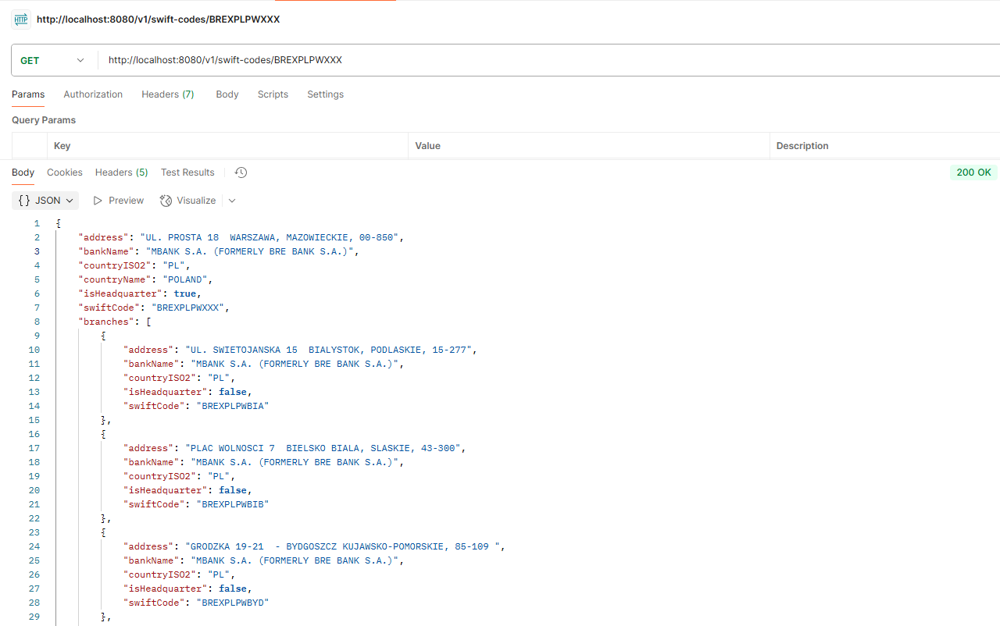
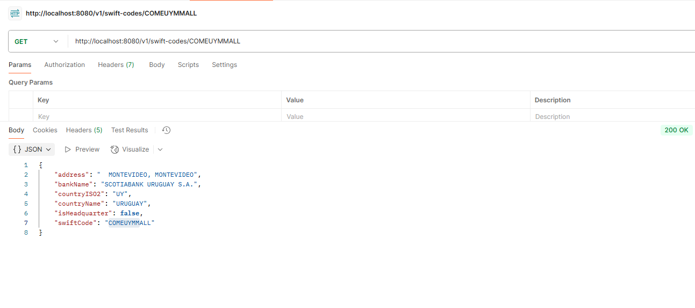
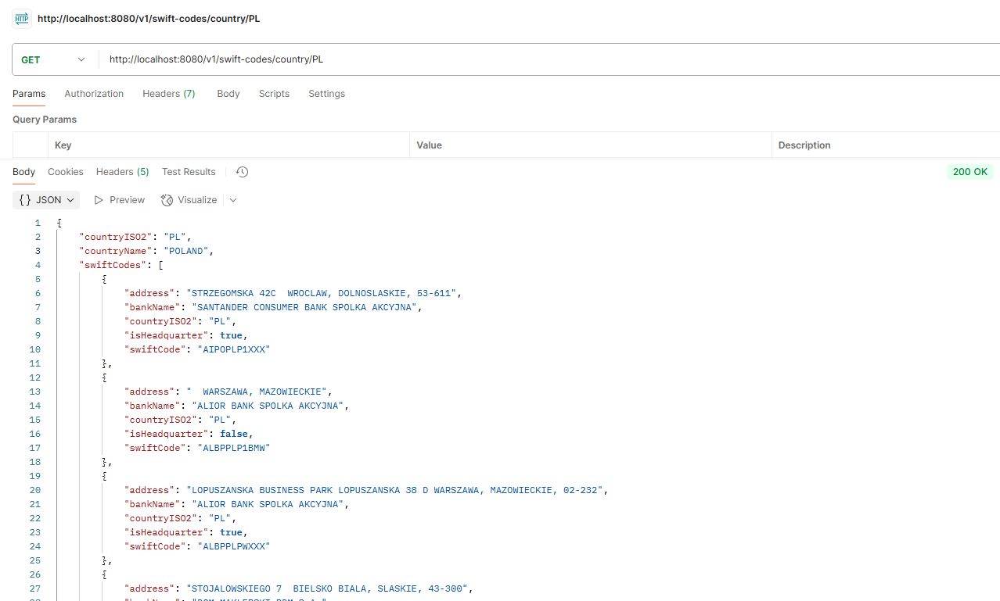
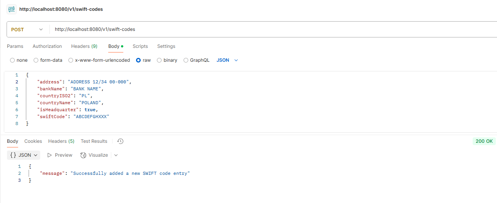
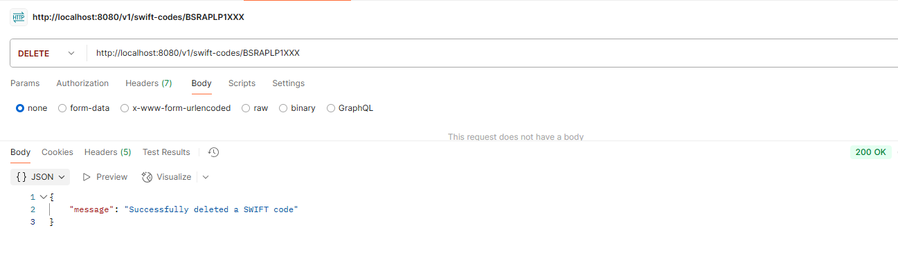
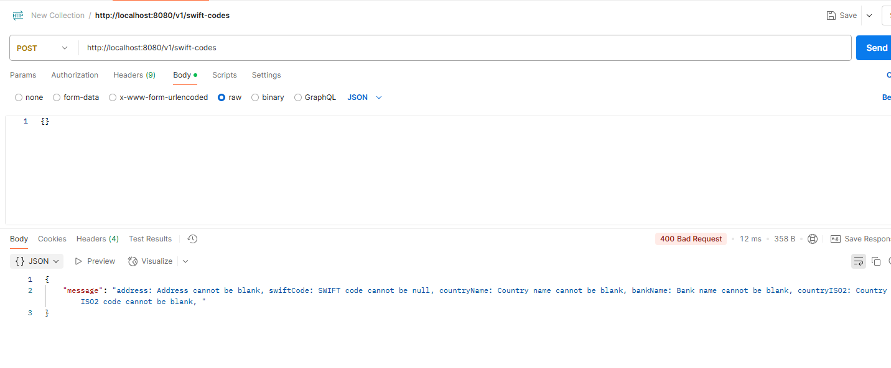
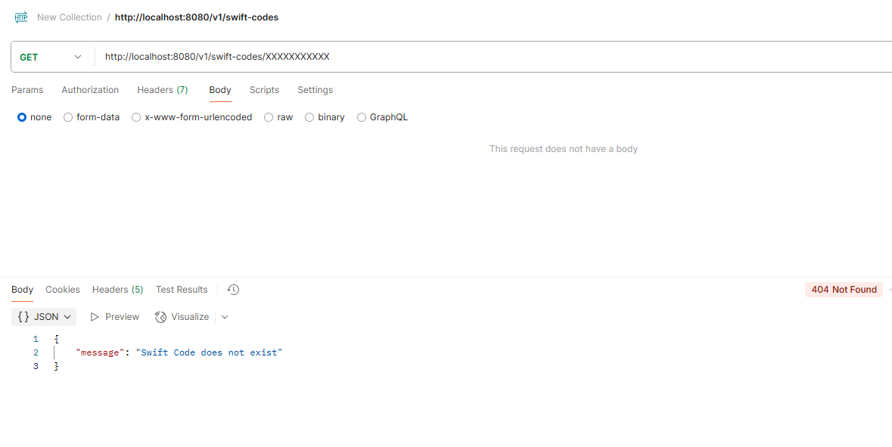

# Remitly Internship 2025 - Task
## Information about project
Repository contains a solution for Remitly Internship 2025 Home Exercise.
This application parses CSV data into a database and provides a REST API with endpoints that allows to retrieve, add and delete SWIFT codes.
## Technologies
- Java 21
- Maven
- Spring Boot 3.4.4
- PostgreSQL
- Docker and Docker Compose
## How to run
**1. Clone the repository:**
```bash
git clone https://github.com/Epic215/Remitly_Internship_2025_Task.git
```
**2. Move to directory:**
```bash
cd Remitly_Internship_2025_Task/Task
```
**3. Run command:**
```bash
mvn clean package
```
**4. Run docker compose:**
```bash
docker compose up -d
```
After this steps the API will be available at http://localhost:8080.
## Endpoints
### Endpoint 1: Retrieve details of a single SWIFT code whether for a headquarters or branches
- **GET:** /v1/swift-codes/{swift-code}:
- **Response Structure** for headquarter swift code:
```json
{
  "address": "string",
  "bankName": "string",
  "countryISO2": "string",
  "countryName": "string",
  "isHeadquarter": "bool",
  "swiftCode": "string"
  "branches": [
      {
          "address": "string"
          "bankName": "string",
          "countryISO2": "string",
          "isHeadquarter": "bool",
          "swiftCode": "string"
      },
      {
          "address": "string",
          "bankName": "string",
          "countryISO2": "string",
          "isHeadquarter": "bool",
          "swiftCode": "string"
      },
      ...
]
}
```
- **Response Structure** for branch swift code:
```json
{
    "address": "string",
    "bankName": "string",
    "countryISO2": "string",
    "countryName": "string",
    "isHeadquarter": "bool",
    "swiftCode": "string"
}

```
- Example headquarter in Postman for **GET:** /v1/swift-codes/BREXPLPWXXX:

- Example branch in Postman for **GET:** /v1/swift-codes/COMEUYMMALL:
 
### Endpoint 2: Return all SWIFT codes with details for a specific country (both headquarters and branches).
- **GET:** /v1/swift-codes/country/{countryISO2code}:
- **Response Structure**:
```json
{
"countryISO2": "string",
"countryName": "string",
"swiftCodes": [
      {
          "address": "string",
          "bankName": "string",
          "countryISO2": "string",
          "isHeadquarter": "bool",
          "swiftCode": "string"
      },
      {
          "address": "string",
          "bankName": "string",
          "countryISO2": "string",
          "isHeadquarter": "bool",
          "swiftCode": "string"
      },
      ...
]
}
```
- Example in Postman for **GET:** /v1/swift-codes/country/PL:
 
### Endpoint 3: Adds new SWIFT code entries to the database for a specific country.
- **POST:** /v1/swift-codes:
- **Request Structure**:
```json

{
    "address": "string",
    "bankName": "string",
    "countryISO2": "string",
    "countryName": "string",
    "isHeadquarter": "bool",
    "swiftCode": "string",
}
```
- **Response Structure**:
```json
{
    "message": "string",
}
```
- Example in Postman for **POST:** /v1/swift-codes:
 
### Endpoint 4: Deletes swift-code data if swiftCode matches the one in the database.
- **DELETE:** /v1/swift-codes/{swift-code}:
- **Response Structure**:
```json
{
    "message": "string",
}
```
- Example in Postman for **DELETE:** /v1/swift-codes/BSRAPLP1XXX:
 
## Tests
1. To run test use command:
```bash
mvn test
```
2. Some error handling was tested manually using Postman. Below, I have attached some test results.

 
